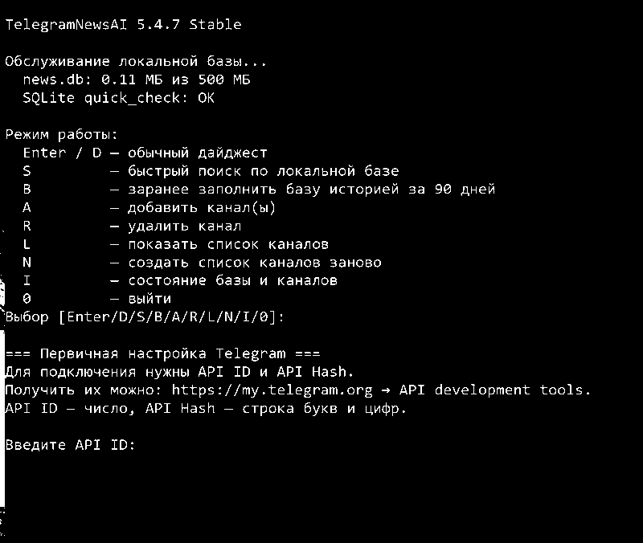
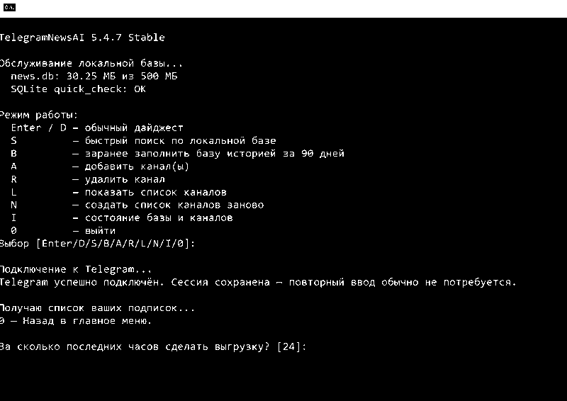
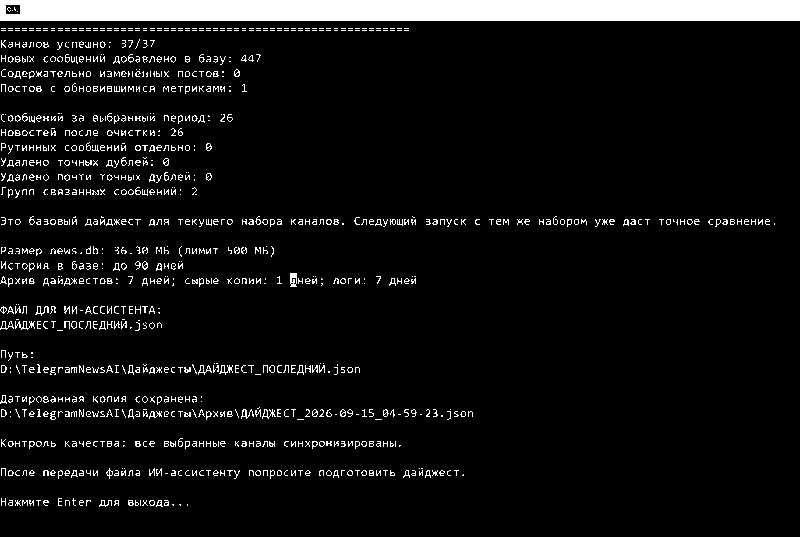

# Unofficial TelegramNewsAI

<p align="center">
  
</p>

> [!NOTE]
> **Текущая версия — 5.4.14 Testing.** Offline-проверки и защитные regression tests пройдены. Изменения 5.4.14 относятся к качеству JSON и последующего дайджеста; сетевой профиль 5.4.13 не менялся, его реальные испытания Telegram API продолжаются параллельно. Канал Testing означает, что сетевой профиль ещё проверяется в длительной работе, а не что основная функция проекта приостановлена.


[](https://github.com/ccuriu/TelegramNewsAI/actions/workflows/ci.yml)


[](LICENSE)


**Unofficial TelegramNewsAI — локальная Windows-программа для тех, кто не хочет вручную перечитывать десятки Telegram-каналов после перерыва.** Она собирает публикации выбранных каналов, сохраняет историю в SQLite, догружает пропущенное, ищет по архиву и готовит структурированный JSON для анализа в выбранном ИИ-ассистенте. Программа сама не отправляет содержимое Telegram во внешние AI/ML-сервисы.

**Поддерживаемые системы: Windows 10 и Windows 11.**

**Локальное хранение · без отдельного сервера · не требует постоянно запущенной программы · ИИ выбирает пользователь.** Telegram Desktop не нужен: подключение к Telegram выполняется напрямую через Telethon, а готовый JSON пользователь передаёт в ChatGPT или другую подходящую модель сам.

> [!NOTE]
> **О Telegram API.** Текущие и предыдущие контрольные тесты проекта проходят без наблюдавшихся ограничений аккаунта и сбоев Telegram-сессии. При этом в официальной документации Telegram есть общее предупреждение о дополнительном антиспам-контроле для неофициальных API-клиентов, а точные критерии и лимиты не раскрываются. Это не является указанием на проблему именно этой программы, но этот фактор учитывается в архитектуре и в плане тестирования. Подробнее — в разделе [«Telegram API и тестирование»](#telegram-api-и-тестирование).

**На публичные каналы не обязательно быть подписанным.** Их можно добавлять по `@username`, ссылке `https://t.me/channel` или ссылке на конкретный пост. Несколько каналов можно добавить за один раз, перечислив их через запятую. При пересоздании списка в одной строке можно смешивать номера подписок, диапазоны, `@username` и ссылки `t.me`, например `3,7-10,https://t.me/channel`.

Unofficial TelegramNewsAI не пытается определять важность события по числу одинаковых публикаций. Экспорт сохраняет источники, временную последовательность и различия между сообщениями, чтобы ИИ мог объединять повторы в события, учитывать уточнения и отделять подтверждённые сведения от заявлений, оценок и неподтверждённых сообщений.

Формат JSON не привязан к конкретной модели. Поле `recommended_digest_request` содержит готовую редакционную инструкцию для итогового дайджеста или тематического обзора. Основной проверяемый сценарий — передать файл в ChatGPT, но можно использовать другую подходящую модель. TelegramNewsAI сам модель не вызывает и файл никуда не отправляет.

Проект рассчитан прежде всего на **личный мониторинг ограниченного набора Telegram-каналов и анализ пропущенной информации** — обычно десятков каналов, а не тысяч. Он не проектировался как инструмент массового непрерывного сбора огромных массивов истории.

## Как это работает

**Telegram-каналы → Unofficial TelegramNewsAI → локальный архив SQLite → выбранный период или тематический поиск → структурированный JSON → выбранный пользователем ИИ → дайджест событий**

Программу не нужно держать запущенной постоянно: при следующем запуске она догрузит пропущенные публикации в пределах доступной истории. Telegram-сессия, настройки, база, учётные данные и JSON-экспорты остаются на компьютере пользователя. Во внешний ИИ передаётся только тот файл, который пользователь сам решил проанализировать.

После создания обычного дайджеста или результата поиска **Проводник Windows открывается автоматически и выделяет готовый JSON-файл**. Постоянные файлы `ДАЙДЖЕСТ_ПОСЛЕДНИЙ.json` и `ПОИСК_ПОСЛЕДНИЙ.json` при следующем соответствующем запуске заменяются новыми версиями, поэтому актуальный результат всегда лежит по одному и тому же понятному пути. Одновременно программа сохраняет датированные архивные копии: обычные дайджесты — в `Дайджесты\Архив`, результаты поиска — в `Дайджесты\Архив\Поиск`.

## Как выглядит

### 1. Первичная настройка Telegram

При первом запуске программа объясняет, где получить API ID и API Hash, после чего сохраняет учётные данные локально в защищённом виде.



### 2. Создание дайджеста

После выбора обычного дайджеста программа подключается к Telegram, использует сохранённую сессию и предлагает указать период.



### 3. Готовый файл

После синхронизации программа показывает краткий контроль результата, сохраняет актуальный JSON и датированную архивную копию, затем автоматически открывает Проводник с выделенным готовым файлом.



**Что делать дальше:** загрузите `ДАЙДЖЕСТ_ПОСЛЕДНИЙ.json` или `ПОИСК_ПОСЛЕДНИЙ.json` в выбранный ИИ-ассистент и попросите выполнить встроенную `recommended_digest_request`. Для ChatGPT обычно достаточно загрузить файл и написать «дайджест». Передача остаётся полностью под контролем пользователя; Unofficial TelegramNewsAI не отправляет файл автоматически.

## Возможности

- сбор новых публикаций и недостающей истории выбранного периода;
- добавление публичных каналов без обязательной подписки; несколько адресов можно указать одной строкой через запятую;
- локальное хранение публикаций и редакций в `news.db`;
- различение содержательных правок и изменений метрик;
- осторожная дедупликация: точные копии схлопываются с сохранением источников и различающихся метаданных, а похожие сообщения не удаляются — их связь служит только подсказкой для последующего анализа;
- сохранение предыдущих содержательных редакций публикации без служебных хэшей и внутренних полей базы;
- отделение изменений старых публикаций от основного временного окна: они могут попасть в «Что изменилось», но не расширяют сам выбранный период;
- быстрый поиск через SQLite FTS5;
- подготовка `ДАЙДЖЕСТ_ПОСЛЕДНИЙ.json` и тематических поисковых выгрузок;
- автоматическое открытие Проводника с выделенным готовым файлом после дайджеста и поиска;
- замена файла «последний» новой версией при следующем запуске с одновременным сохранением датированной архивной копии;
- прямые ссылки на исходные публикации публичных Telegram-каналов, когда они доступны;
- локальный тематический поиск через SQLite FTS5/LIKE без ML-модели.

## Как устроена дедупликация

TelegramNewsAI намеренно использует осторожную схему дедупликации: приоритет — не потерять единственное важное уточнение ради более короткого экспорта.

- **Точные копии** могут схлопываться в одну основную публикацию. При этом сведения о повторных публикациях сохраняются в структуре сообщения, а число повторов не считается доказательством достоверности события.
- **Почти одинаковые тексты** не удаляются. Для длинных сообщений программа может отметить очень высокую текстовую схожесть как связь между публикациями; различия в цифрах, именах, отрицаниях и формулировках остаются в экспорте. По умолчанию используется строгий порог сходства `0.985` в окне до 3 часов.
- **Пересылки одного Telegram-поста и сообщения с одним каноническим URL** группируются как связанные, но их тексты не уничтожаются.
- **Одна новость, написанная совершенно разными словами**, на этапе сборщика специально не удаляется как дубль. Оба сообщения попадают в JSON вместе с источниками и временем, чтобы последующий анализ мог объединить их в один событийный блок, сохраняя отличающиеся факты, цифры, версии и ссылки на первоисточники.

Такой подход немного увеличивает объём экспорта, зато снижает риск удалить сообщение, которое внешне похоже на другое, но содержит существенное уточнение.

## Установка

**Публичные сборки временно не публикуются до завершения полного цикла тестирования.** После проверки разных нагрузок, периодов истории и финальной валидации стабильности раздел публичной установки будет возвращён.

### Как получить API ID и API Hash

1. Откройте [my.telegram.org](https://my.telegram.org) и войдите по номеру телефона вашего Telegram-аккаунта.
2. Выберите **API development tools**.
3. Если приложение для этого номера ещё не создавалось, Telegram предложит заполнить короткую форму. Укажите название приложения и остальные необходимые поля.
4. После создания приложения на странице появятся **App api_id** и **App api_hash** — именно их нужно ввести при первом запуске Unofficial TelegramNewsAI.

Официальная инструкция Telegram: [Creating your Telegram Application](https://core.telegram.org/api/obtaining_api_id).


### Telegram API и тестирование

Unofficial TelegramNewsAI использует обычную пользовательскую MTProto-сессию через Telethon только для чтения выбранных каналов и истории. В проведённых к настоящему моменту рабочих тестах не наблюдались FloodWait, потеря сессии, повторная авторизация или ограничения аккаунта, связанные с обычным сценарием использования.

Telegram при этом официально предупреждает, что аккаунты, использующие неофициальные API-клиенты, находятся под дополнительным антиспам-контролем. Точные критерии и универсальные лимиты публично не раскрываются. Это предупреждение относится к классу сторонних клиентов в целом и не означает, что ограничения обязательно применимы к Unofficial TelegramNewsAI. Тем не менее проект учитывает его и поэтому проходит дополнительное тестирование перед повторным открытием репозитория.

До приостановки публичного распространения программа использовалась в основном с подборкой примерно **35–50 каналов**. Сейчас испытания проводятся ступенчато: сначала обычные 24-часовые дайджесты на текущем наборе каналов, затем более длинные периоды истории и только после этого — увеличение числа каналов. Нагрузка повышается по одному параметру за раз, чтобы результат можно было интерпретировать.

Программа:

- не отправляет сообщения, реакции или публикации от имени пользователя;
- не подписывает аккаунт на каналы автоматически;
- синхронизирует каналы последовательно, без параллельного массового обхода;
- делает любой `FloodWait` видимым приложению и прекращает текущий сетевой этап без автоматического повторения нагрузки;
- прекращает сетевой этап при ошибках, похожих на ограничение аккаунта или потерю авторизации;
- при обычном запуске сначала использует локальный entity-cache Telethon и не читает полный список диалогов без необходимости;
- использует умеренный последовательный сетевой профиль: 0,5 с между последовательными запросами большой истории и короткую паузу 0,25 с между каналами; для наборов свыше 100 каналов межканальная пауза увеличивается до 0,5 с;
- не начинает новую авторизацию автоматически, если существующая сессия исчезла или перестала быть авторизованной; для осознанного восстановления есть команда `T`;
- блокирует одновременный обычный запуск двух копий программы в одной Windows-сессии.

Такой профиль не является способом обхода ограничений Telegram. Его задача — убрать лишние запросы, корректно реагировать на серверные сигналы и получить надёжно протестированное поведение до public-релиза.

План и фактические результаты испытаний: [docs/TELEGRAM_API_TESTING.md](docs/TELEGRAM_API_TESTING.md).

Источники: [Telegram — Creating your Telegram Application](https://core.telegram.org/api/obtaining_api_id), [Telegram — RPC errors / FLOOD_WAIT](https://core.telegram.org/api/errors), [Telethon FAQ](https://docs.telethon.dev/en/stable/quick-references/faq.html).

## Правила Telegram и условия повторного открытия

Репозиторий остаётся приватным до завершения полного цикла тестирования и финальной проверки требований Telegram, относящихся к публичному распространению. Это рабочий этап подготовки к повторному открытию, а не отказ от public-релиза.

- Пользовательское название **Unofficial TelegramNewsAI** сохраняется так, чтобы не создавать впечатление официального продукта Telegram.
- Каждый пользователь использует собственные `api_id` и `api_hash`.
- Программа сама не отправляет Telegram-контент во внешние AI/ML-сервисы; локальный поиск работает через SQLite FTS5/LIKE без ML/embedding-модели.
- Встроенная редакционная инструкция предназначена для пользовательского анализа подготовленного JSON выбранной моделью; автоматической передачи данных нет.
- Вопрос Sponsored Messages для текущей пакетной архитектуры collector/search/export уже закрыт: программа не является интерфейсом чтения Telegram-каналов и не запрашивает отдельный рекламный поток. Повторная проверка понадобится только при появлении встроенного просмотрщика контента.

Открытие репозитория планируется после завершения оставшихся реальных испытаний сетевого профиля и финальной проверки стабильности/целостности данных.

Официальные источники: [Telegram API Terms](https://core.telegram.org/api/terms), [Telegram Content Licensing](https://telegram.org/tos/content-licensing), [Sponsored Messages](https://core.telegram.org/api/sponsored-messages).
Для скрытого поля API Hash программа проверяет формат до подключения. Если вставка сочетанием клавиш в консоли сработала неправильно, используйте `Shift+Insert` или правую кнопку мыши — корректный API Hash содержит 32 шестнадцатеричных символа.

**Не публикуйте API Hash и не отправляйте его посторонним.** В репозитории нет общих или тестовых API-данных — каждый пользователь использует свои.

Без `Telegram_Digest.exe` программу можно запустить через `start_free.bat` или напрямую:

```bat
.venv\Scripts\python.exe telegram_collector_free.py
```

## Команды

- `Enter` или `D` — создать обычный дайджест за выбранный период;
- `S` — искать по локальной базе с предложением обновить устаревшие каналы;
- `B` — первоначально загрузить историю за 90 дней;
- `A` — добавить один или несколько публичных каналов без подписки; несколько адресов можно перечислить через запятую;
- `R` — удалить канал;
- `L` — показать выбранные каналы;
- `N` — создать список каналов заново;
- `I` — показать состояние базы и каналов;
- `T` — явно пересоздать Telegram-сессию, если она отсутствует, отозвана или пользователь хочет войти заново;
- `0` — выйти.

Во вложенных пунктах `0` отменяет незавершённый ввод и возвращает в главное меню без изменения уже сохранённого списка каналов.

Unofficial TelegramNewsAI не допускает одновременный запуск двух копий программы в одной Windows-сессии, даже если они находятся в разных папках. Это защищает Telegram-сессию от конфликтующих соединений. Технические сетевые предупреждения Telethon сохраняются в `logs`, а не выводятся в обычное меню.

Если сохранённая сессия исчезла или перестала быть авторизованной, программа **не начинает скрытый повторный вход**. Команда `T` явно предупреждает, что будет удалён только локальный файл сессии, просит подтверждение и затем запускает обычную авторизацию с новым кодом. `credentials.bin`, список каналов, база и дайджесты при этом сохраняются.

## База и поиск

`news.db` содержит локальную историю публикаций, метаданные каналов, сведения о полноте синхронизации и предыдущие редакции сообщений. По умолчанию история хранится до 90 дней, размер базы ограничен 500 МБ.

Поиск работает локально через SQLite FTS5. По умолчанию экспортируется до 1500 наиболее релевантных результатов; если совпадений больше, программа предлагает выгрузить всё. Найденные публикации сохраняют предыдущие редакции, а сообщения с одним конкретным первоисточником получают `related_message_groups`, чтобы ИИ не принимал перепечатки за независимые подтверждения. После создания результата поиска Проводник автоматически открывается с выделенным `ПОИСК_ПОСЛЕДНИЙ.json`; при следующем поиске этот файл заменяется новым, а датированная копия сохраняется в архиве поиска.

Смысловой ML/embedding-поиск по Telegram-контенту начиная с 5.4.13 Testing не используется. Для текущего масштаба локальный SQLite FTS5/LIKE даёт нужную скорость и простоту без тяжёлой модели; ИИ применяется на следующем этапе — для анализа уже подготовленного JSON.

## Источники в готовом дайджесте

Unofficial TelegramNewsAI не предполагает конкретную тематику каналов: структура и стиль итогового дайджеста автоматически адаптируются к фактическому содержанию выбранной подборки. Программа подходит для новостей, тематических каналов и смешанных подборок; фиксированных географических или тематических рубрик нет.

Для публичных каналов источник по возможности ведёт непосредственно на конкретную исходную публикацию Telegram. Название канала становится Markdown-ссылкой на этот пост; ссылка на сам канал используется только как резервный вариант, если ссылка на публикацию недоступна. Для публичного источника пересылки ссылка на исходный пост также сохраняется, когда Telegram предоставляет username и номер публикации. Для приватного источника URL не конструируется. Если нет ни одной доступной ссылки, остаётся обычное название канала — программа не придумывает URL и не добавляет отдельную ссылку «Открыть публикацию».

В JSON-схеме 8 одинаковые `text` и `raw_text` больше не дублируются: если `raw_text` отсутствует и `raw_text_available` не равно `false`, исходный текст совпадает с `text` после удаления краевых пробелов. Если очистка действительно изменила текст, `raw_text` сохраняется целиком. Пустые необязательные массивы, пустое описание медиа, нулевая история редакций и обычное состояние `availability=available` также не повторяются в каждом сообщении; исключительные значения сохраняются. Это уменьшает объём AI-ориентированного файла без потери содержания.

При наличии сопоставимого предыдущего выпуска Unofficial TelegramNewsAI может дополнительно выделить существенные изменения. Основной дайджест при этом остаётся полной сводкой выбранного периода.

## Конфиденциальность

API ID, API Hash и номер телефона вводятся локально. Они сохраняются в `credentials.bin`, защищённом Windows DPAPI. Telegram-сессия, настройки, выбранные каналы, база, логи и дайджесты также остаются на компьютере пользователя.

Не публикуйте и не прикладывайте к Issues:

- `credentials.bin` и `credentials.unreadable-*.bin`;
- `*.session` и `*.session-journal`;
- `news.db*`;
- `settings_free.json` и `selected_channels.json`;
- содержимое `Дайджесты`, `logs` и `Резервные_копии`.

Подробнее: [SECURITY.md](SECURITY.md).

## Перенос на другой компьютер

Для чистого переноса используйте ZIP из Releases и снова запустите `INSTALL.bat`. Не копируйте на другой компьютер `credentials.bin`, `*.session`, `news.db*`, настройки, логи, модели и личные дайджесты. DPAPI-файл с учётными данными привязан к профилю Windows и на другом компьютере обычно не расшифруется. Авторизуйтесь заново и создайте новую локальную базу.

## Удаление программы

Unofficial TelegramNewsAI не требует отдельного деинсталлятора.

1. Закройте Unofficial TelegramNewsAI.
2. Удалите папку, в которую была распакована программа.
3. Удалите ярлык `Unofficial TelegramNewsAI` с рабочего стола, если он был создан установщиком.

Вместе с папкой программы удаляются её локальные данные: Telegram-сессия, сохранённые API-данные, настройки, выбранные каналы, база сообщений, дайджесты, логи, резервные копии и изолированное окружение `.venv`. Если какие-либо из этих данных нужны, заранее скопируйте их в безопасное место.

Если при установке Unofficial TelegramNewsAI автоматически был установлен Python 3.13, он является отдельной программой Windows и при удалении папки Unofficial TelegramNewsAI не удаляется. Его можно оставить: он не мешает работе системы и может использоваться другими программами.

## Разработка и проверки

Поддерживается Python 3.10 или новее. Основная обязательная зависимость — `Telethon==1.44.0`. ML-библиотеки для обработки Telegram-контента не устанавливаются и не используются.

Windows CI на Python 3.13 проверяет:

- установку зависимости и импорт Telethon;
- компиляцию `telegram_collector_free.py`;
- локальные regression tests без Telegram-аккаунта и сетевых запросов;
- отсутствие отслеживаемых пользовательских файлов;
- сборку и самопроверку launcher;
- точный состав чистого ZIP-релиза.

Исходник и инструкция сборки `Telegram_Digest.exe` находятся в каталоге [`launcher`](https://github.com/ccuriu/TelegramNewsAI/tree/main/launcher). SHA-256 текущего EXE записан в [`Telegram_Digest.exe.sha256`](Telegram_Digest.exe.sha256).

Чистый ZIP собирается сценарием [`scripts/build_release.ps1`](https://github.com/ccuriu/TelegramNewsAI/blob/main/scripts/build_release.ps1). Результат и его SHA-256 создаются в `dist/` и не добавляются в Git; CI проверяет точный состав и сохраняет эти же файлы как release artifact.

## Сообщить о проблеме

Используйте [Issues](https://github.com/ccuriu/TelegramNewsAI/issues) и выберите шаблон ошибки или предложения. Перед отправкой удалите из текста и вложений номера телефонов, API-данные, приватные ссылки, сообщения и другие личные сведения.

## Лицензия

Проект распространяется по [лицензии MIT](LICENSE).

TelegramNewsAI организует публикации, но не проверяет достоверность новостей: число повторов не является независимым подтверждением события.