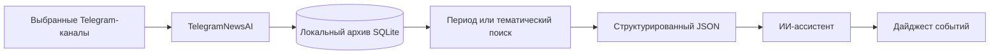

# TelegramNewsAI

[](https://github.com/ccuriu/TelegramNewsAI/actions/workflows/ci.yml)


[](LICENSE)


**TelegramNewsAI — локальная Windows-программа для тех, кто не хочет вручную перечитывать десятки Telegram-каналов после перерыва.** Она собирает публикации выбранных каналов, сохраняет историю в SQLite, догружает пропущенное, ищет по архиву и готовит структурированный материал для содержательного анализа в ИИ-ассистентах.

**Локальное хранение · без отдельного сервера · не требует постоянно запущенной программы · не привязана к одной ИИ-модели.** Telegram Desktop не нужен: подключение к Telegram выполняется напрямую через Telethon.

TelegramNewsAI не пытается определять важность события по числу одинаковых публикаций. Экспорт сохраняет источники, временную последовательность и различия между сообщениями, чтобы ИИ мог объединять повторы в события, учитывать уточнения и отделять подтверждённые сведения от заявлений, оценок и неподтверждённых сообщений.

Формат выгрузки не привязан к конкретной модели. Встроенная редакционная инструкция рассчитана на современные ИИ-ассистенты; основное тестирование TelegramNewsAI проводится в ChatGPT. Отображение Markdown-ссылок и соблюдение встроенных инструкций может различаться между платформами.

## Как это работает



Программу не нужно держать запущенной постоянно: при следующем запуске она догрузит пропущенные публикации в пределах доступной истории. Telegram-сессия, настройки, база и учётные данные остаются на компьютере пользователя; в ИИ передаётся только тот экспорт, который пользователь сам решил проанализировать.

## Возможности

- сбор новых публикаций и недостающей истории выбранного периода;
- локальное хранение публикаций и редакций в `news.db`;
- различение содержательных правок и изменений метрик;
- схлопывание точных дублей без удаления похожих сообщений с другими цифрами, именами или формулировками;
- быстрый поиск через SQLite FTS5;
- подготовка `ДАЙДЖЕСТ_ПОСЛЕДНИЙ.json` и тематических поисковых выгрузок;
- прямые ссылки на исходные публикации публичных Telegram-каналов, когда они доступны;
- опциональный смысловой поиск без обязательной установки тяжёлых моделей.

## Установка с нуля

1. Откройте [Releases](https://github.com/ccuriu/TelegramNewsAI/releases) и скачайте ZIP последней стабильной Windows-версии.
2. Сверьте SHA-256 архива с приложенным `.sha256.txt`.
3. Распакуйте ZIP в обычную папку, например `C:\TelegramNewsAI`.
4. Запустите `INSTALL.bat`.
5. Установщик использует Python 3.10 или новее либо предложит установить Python 3.13 через Windows Package Manager, создаст отдельное `.venv` и установит зависимости.
6. Запустите `Telegram_Digest.exe` или созданный на рабочем столе ярлык.
7. При первом запуске введите собственные Telegram API ID, API Hash и номер телефона, затем код подтверждения Telegram и выберите каналы.

### Как получить API ID и API Hash

1. Откройте [my.telegram.org](https://my.telegram.org) и войдите по номеру телефона вашего Telegram-аккаунта.
2. Выберите **API development tools**.
3. Если приложение для этого номера ещё не создавалось, Telegram предложит заполнить короткую форму. Укажите название приложения и остальные необходимые поля.
4. После создания приложения на странице появятся **App api_id** и **App api_hash** — именно их нужно ввести при первом запуске TelegramNewsAI.

Официальная инструкция Telegram: [Creating your Telegram Application](https://core.telegram.org/api/obtaining_api_id).

**Не публикуйте API Hash и не отправляйте его посторонним.** В репозитории нет общих или тестовых API-данных — каждый пользователь использует свои.

Без `Telegram_Digest.exe` программу можно запустить через `start_free.bat` или напрямую:

```bat
.venv\Scripts\python.exe telegram_collector_free.py
```

## Команды

- `Enter` или `D` — создать обычный дайджест за выбранный период;
- `S` — искать по локальной базе с предложением обновить устаревшие каналы;
- `B` — первоначально загрузить историю за 90 дней;
- `A` — добавить один или несколько публичных каналов;
- `R` — удалить канал;
- `L` — показать выбранные каналы;
- `N` — создать список каналов заново;
- `I` — показать состояние базы и каналов;
- `0` — выйти.

Во вложенных пунктах `0` отменяет незавершённый ввод и возвращает в главное меню без изменения уже сохранённого списка каналов.

## База и поиск

`news.db` содержит локальную историю публикаций, метаданные каналов, сведения о полноте синхронизации и предыдущие редакции сообщений. По умолчанию история хранится до 90 дней, размер базы ограничен 500 МБ.

Поиск работает локально через SQLite FTS5. По умолчанию экспортируется до 1500 наиболее релевантных результатов; если совпадений больше, программа предлагает выгрузить всё. Опциональный смысловой поиск не является обязательной зависимостью и по умолчанию отключён. Чтобы включить его, один раз запустите `.venv\Scripts\python.exe telegram_collector_free.py --setup-semantic`.

## Источники в готовом дайджесте

TelegramNewsAI не предполагает конкретную тематику каналов: структура и стиль итогового дайджеста автоматически адаптируются к фактическому содержанию выбранной подборки. Программа подходит для новостей, тематических каналов и смешанных подборок; фиксированных географических или тематических рубрик нет.

Для публичных каналов источник по возможности ведёт непосредственно на конкретную исходную публикацию Telegram. Название канала становится Markdown-ссылкой на этот пост; ссылка на сам канал используется только как резервный вариант, если ссылка на публикацию недоступна. Если нет ни одной доступной ссылки, остаётся обычное название канала — программа не придумывает URL и не добавляет отдельную ссылку «Открыть публикацию».

При наличии сопоставимого предыдущего выпуска TelegramNewsAI может дополнительно выделить существенные изменения. Основной дайджест при этом остаётся полной сводкой выбранного периода.

## Конфиденциальность

API ID, API Hash и номер телефона вводятся локально. Они сохраняются в `credentials.bin`, защищённом Windows DPAPI. Telegram-сессия, настройки, выбранные каналы, база, логи и дайджесты также остаются на компьютере пользователя.

Не публикуйте и не прикладывайте к Issues:

- `credentials.bin` и `credentials.unreadable-*.bin`;
- `*.session` и `*.session-journal`;
- `news.db*`;
- `settings_free.json` и `selected_channels.json`;
- содержимое `Дайджесты`, `logs` и `Резервные_копии`.

Подробнее: [SECURITY.md](SECURITY.md).

## Перенос на другой компьютер

Для чистого переноса используйте ZIP из Releases и снова запустите `INSTALL.bat`. Не копируйте на другой компьютер `credentials.bin`, `*.session`, `news.db*`, настройки, логи, модели и личные дайджесты. DPAPI-файл с учётными данными привязан к профилю Windows и на другом компьютере обычно не расшифруется. Авторизуйтесь заново и создайте новую локальную базу.

## Удаление программы

TelegramNewsAI не требует отдельного деинсталлятора.

1. Закройте TelegramNewsAI.
2. Удалите папку, в которую была распакована программа.
3. Удалите ярлык `TelegramNewsAI` с рабочего стола, если он был создан установщиком.

Вместе с папкой программы удаляются её локальные данные: Telegram-сессия, сохранённые API-данные, настройки, выбранные каналы, база сообщений, дайджесты, логи, резервные копии и изолированное окружение `.venv`. Если какие-либо из этих данных нужны, заранее скопируйте их в безопасное место.

Если при установке TelegramNewsAI автоматически был установлен Python 3.13, он является отдельной программой Windows и при удалении папки TelegramNewsAI не удаляется. Его можно оставить: он не мешает работе системы и может использоваться другими программами.

## Разработка и проверки

Поддерживается Python 3.10 или новее. Основная обязательная зависимость — `Telethon==1.44.0`. Тяжёлые библиотеки смыслового поиска не устанавливаются автоматически.

Windows CI на Python 3.13 проверяет:

- установку зависимости и импорт Telethon;
- компиляцию `telegram_collector_free.py`;
- локальные regression tests без Telegram-аккаунта и сетевых запросов;
- отсутствие отслеживаемых пользовательских файлов;
- сборку и самопроверку launcher;
- точный состав чистого ZIP-релиза.

Исходник и инструкция сборки `Telegram_Digest.exe` находятся в каталоге [`launcher`](https://github.com/ccuriu/TelegramNewsAI/tree/main/launcher). SHA-256 текущего EXE записан в [`Telegram_Digest.exe.sha256`](Telegram_Digest.exe.sha256).

Чистый ZIP собирается сценарием [`scripts/build_release.ps1`](https://github.com/ccuriu/TelegramNewsAI/blob/main/scripts/build_release.ps1). Результат и его SHA-256 создаются в `dist/` и не добавляются в Git; CI проверяет точный состав и сохраняет эти же файлы как release artifact.

## Сообщить о проблеме

Используйте [Issues](https://github.com/ccuriu/TelegramNewsAI/issues) и выберите шаблон ошибки или предложения. Перед отправкой удалите из текста и вложений номера телефонов, API-данные, приватные ссылки, сообщения и другие личные сведения.

## Лицензия

Проект распространяется по [лицензии MIT](LICENSE).

TelegramNewsAI организует публикации, но не проверяет достоверность новостей: число повторов не является независимым подтверждением события.
